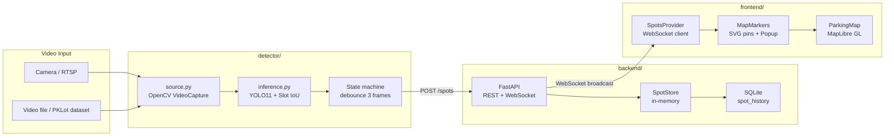

# Smart Parking Detector

> Turn city cameras into a friendly assistant that helps drivers find open parking — or spots that are likely to be free soon.

Each parking spot on the map shows one of three states in real time:

| Color | Meaning |
|-------|---------|
| Green | Available |
| Yellow | Potentially available soon (car pulling out, door open) |
| Red | Occupied |

---

## Architecture



---

## Quick Start

### 1. Backend

```bash
cd backend
pip install -r requirements.txt
uvicorn app.main:app --reload
# API runs at http://127.0.0.1:8000
```

### 2. Frontend

```bash
cd frontend
npm install
cp ENV_EXAMPLE.txt .env
# Edit .env and add your free MapTiler key (https://maptiler.com)
npm run dev
# Opens at http://localhost:5173
```

### 3. Detector *(optional — backend ships a simulator for demos)*

```bash
cd detector
pip install -r requirements.txt
cp slots.example.json slots.json
# Edit slots.json with your camera's slot polygons
python -m detector.main --source 0          # webcam
python -m detector.main --source video.mp4  # file
python -m detector.main --source rtsp://... # RTSP stream
python -m detector.main --source 0 --preview  # show annotated window
```

---

## Folder Layout

```
Smart-Parking-Detector/
├── Description/              # Reference assets (images, PDF, PSD)
├── backend/                  # FastAPI service
│   ├── app/
│   │   ├── main.py           # App factory, routes, lifespan, simulator
│   │   ├── models.py         # Spot & Event Pydantic models
│   │   ├── store.py          # In-memory SpotStore + SQLite write-through
│   │   ├── hub.py            # WebSocket broadcast hub
│   │   └── db.py             # aiosqlite setup, spot_history table
│   └── requirements.txt
├── detector/                 # Python CV + YOLO service
│   ├── detector/
│   │   ├── main.py           # CLI entry point
│   │   ├── config.py         # Slot config JSON loader
│   │   ├── source.py         # OpenCV VideoCapture wrapper
│   │   └── inference.py      # YOLO11 + per-slot IoU occupancy
│   ├── slots.example.json    # Slot polygon config template
│   └── requirements.txt
├── frontend/                 # React + MapLibre GL
│   ├── src/
│   │   ├── components/       # ParkingMap, MapMarkers, ThemeProvider
│   │   ├── state/            # SpotsProvider (WebSocket client)
│   │   ├── lib/              # api.ts (fetch + WebSocket helpers)
│   │   └── types.ts
│   ├── ENV_EXAMPLE.txt
│   └── package.json
├── docker-compose.yml
└── README.md
```

---

## Configuration

### Frontend (`frontend/.env`)

| Variable | Default | Description |
|----------|---------|-------------|
| `VITE_MAPTILER_KEY` | — | Free MapTiler API key ([maptiler.com](https://maptiler.com)) |
| `VITE_API_URL` | `http://127.0.0.1:8000` | Backend base URL |

### Backend (environment variables)

| Variable | Default | Description |
|----------|---------|-------------|
| `DB_PATH` | `parking.db` | Path to the SQLite database file |
| `CORS_ORIGINS` | `http://localhost:5173,...` | Comma-separated allowed origins |

### Detector (CLI flags)

| Flag | Default | Description |
|------|---------|-------------|
| `--source` | `0` | Webcam index, video file path, or RTSP URL |
| `--config` | `slots.json` | Path to slot config JSON |
| `--model` | `yolo11n.pt` | Ultralytics model name or local path |
| `--iou` | `0.25` | IoU threshold for occupancy |
| `--debounce` | `3` | Frames required to confirm a status change |
| `--skip` | `2` | Process every N-th frame |
| `--preview` | off | Show annotated video window (press `q` to quit) |

---

## Roadmap

| Phase | Status | Deliverable |
|-------|--------|-------------|
| 1 | Done | Frontend (MapLibre) + Backend (SQLite) + Docs |
| 2 | Next | Detector: YOLO11 + slot polygon IoU on a static video / PKLot dataset |
| 3 | Planned | Dwell-time "soon" logic using `spot_history` |
| 4 | Planned | ByteTrack for motion-based "soon" detection |
| 5 | Planned | Multi-camera support + homography calibration |
| 6 | Planned | Three.js synthetic stream for regression testing |
| 7 | Planned | Docker Compose hardening + GPU build + privacy masking |

---

## Prior art

The original mock UI (Leaflet + vanilla JS) and the first React/Mapbox frontend are preserved on the [`v1`](../../tree/v1) branch.

---

## License

MIT — see [`LICENSE`](LICENSE).
