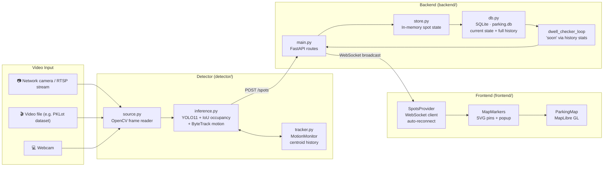

# ParkingSpotter

> A real-time parking availability system: point a camera at a parking lot, and anyone with a browser sees a live map of which spots are free, taken, or about to open up.

---

## What does it do?

Imagine a parking lot with a camera mounted overhead. ParkingSpotter watches that camera, uses AI to recognise cars, and puts coloured pins on an interactive map — one pin per parking spot.

| Pin colour | What it means | How it's decided |
|------------|---------------|------------------|
| 🟢 **Green** | Empty — park here now | No vehicle detected in this spot |
| 🟡 **Yellow** | Probably freeing up soon | Car has been there a long time *and* is likely leaving, or it's visibly moving/pulling out |
| 🔴 **Red** | Taken | A vehicle is covering this spot |

The map updates **instantly** as things change — no page refresh needed.

---

## Why two ways to show "soon"?

"Soon" is the most useful signal for a driver circling the block. ParkingSpotter produces it two ways:

1. **Dwell-time prediction** — the backend keeps a history of how long cars typically park in each spot. When a car has been there for, say, 70 % of the average parking duration, the spot turns yellow. Like knowing a parking meter is about to expire.

2. **Motion detection** — the detector (camera AI) uses vehicle tracking (ByteTrack) to watch whether a car inside a slot has started moving. The moment it detects the car pulling out, the spot turns yellow immediately — no waiting for a timer.

Both signals feed into the same yellow pin on the map.

---

## How the system is built — plain English

ParkingSpotter has three separate pieces that talk to each other:

```
Camera feed  →  Detector (AI)  →  Backend (server)  →  Frontend (map in browser)
```

### 1 — The Detector (the eyes)

A Python program watches a video stream (a webcam, a video file, or a network camera). Each frame is analysed by a pre-trained AI model called **YOLO11** that can recognise cars, trucks, buses, and motorcycles in real time.

For every parking slot you defined (you draw them once as polygons on the video), the detector checks whether a vehicle is overlapping it. To avoid false alarms from a single blurry frame, it requires **several frames in a row** to agree before it reports a change. This is called *debouncing*.

When the status of a spot changes (e.g., a car just parked or just left), the detector sends a small update message to the backend server.

Optional **ByteTrack** mode (`--track`) also assigns a persistent ID to each vehicle across frames. If a car inside a slot starts moving its position — the detector flags it as "soon" immediately, before it has even fully left.

### 2 — The Backend (the brain)

A lightweight Python web server (FastAPI) that:

- Receives updates from the detector (`POST /spots`)
- Remembers the current status of every spot (in memory, fast)
- Saves every status change to a database file (SQLite) so nothing is lost on restart
- Logs the full history of every spot's state — used to calculate typical parking durations
- Pushes updates to every open browser tab the instant something changes, using **WebSocket** (a persistent connection, like a phone call rather than sending letters back and forth)
- Also runs a built-in **simulator** during development, so you can see the map working without a real camera

The backend also exposes a `/spots/{id}/dwell` endpoint that returns statistics about how long cars typically park in a given spot (mean, standard deviation) — the foundation of the dwell-time "soon" prediction.

### 3 — The Frontend (what you see)

A web application built with React that shows a **MapLibre GL** interactive map (free, open-source, runs in any browser). It:

- Loads the current state of all spots on first visit
- Maintains a live WebSocket connection to the backend so it receives updates instantly
- Shows a coloured SVG pin for each spot
- When you click a pin: shows the spot ID, current status, and a "Navigate" link that opens Google Maps directions to that exact spot
- Has a dark/light theme toggle
- Shows a red "Offline" pill in the corner if the connection to the backend is lost, and automatically reconnects with exponential back-off (waits 1 s, then 2 s, then 4 s… up to 30 s between attempts)

---

## Data flow — step by step

Here is exactly what happens when a car parks in spot A1:

```
1. Camera captures a frame.
2. YOLO11 finds a car bounding box in the frame.
3. The detector checks: does this box overlap slot A1 by enough? → Yes.
4. Three frames in a row agree → debounce confirmed.
5. Detector sends:  POST /spots  { id:"A1", status:"occupied", lat:..., lng:... }
6. Backend stores A1=occupied in memory.
7. Backend appends a row to spot_history (timestamp + status) in SQLite.
8. Backend broadcasts  { type:"spot.update", payload: A1 }  over WebSocket.
9. Every open browser tab receives the message.
10. The A1 pin on the map turns red.
```

And when it looks like the car is leaving:

```
(ByteTrack mode)
11. Detector notices A1's vehicle track has moved 20+ pixels in 10 frames.
12. Detector sends:  POST /spots  { id:"A1", status:"soon" }
13. A1 pin turns yellow — driver nearby knows to head there.

(or via dwell-time, no camera motion needed)
11. Backend dwell-checker runs every 15 s.
12. A1 has been occupied for 70 % of its historical mean dwell time.
13. Backend promotes A1 → "soon" and broadcasts the update.
14. A1 pin turns yellow.
```

---

## Architecture diagram



---

## Getting started

You need **Python 3.10+** and **Node.js 20+** installed.

### Step 1 — Start the backend

```bash
cd backend
pip install -r requirements.txt
uvicorn app.main:app --reload
```

The API is now running at `http://127.0.0.1:8000`.
It starts a simulator that randomly cycles spot statuses every 2 seconds — useful for testing without a real camera.

### Step 2 — Start the frontend

**Standard (local drive):**
```bash
cd frontend
npm install
cp ENV_EXAMPLE.txt .env
# Open .env and add your free MapTiler key from https://maptiler.com
npm run dev
```

**Google Drive / OneDrive (Windows only):**
```powershell
cd frontend
# First run: copy ENV_EXAMPLE.txt to .env and add your MapTiler key
.\dev.ps1
```

> `dev.ps1` installs npm packages to `%LOCALAPPDATA%\ParkingSpotter\frontend\` instead of the project folder. This is needed because npm cannot write files reliably on virtual/cloud-synced drives (Google Drive, OneDrive). The script also copies `@types/react` into the local project folder so your code editor (Cursor / VS Code) can find TypeScript types without needing a full local install.

Open `http://localhost:5173` in your browser. You should see a map with coloured pins cycling through states (that's the simulator).

### Step 3 — Run the real detector *(optional)*

The detector is only needed when you want to connect a real camera. The simulator in the backend is enough for UI development and demos.

```bash
# Set the same shared secret in both backend and detector shells first
# PowerShell:   $env:PARKINGSPOTTER_SHARED_SECRET="change-me"
# bash/zsh:     export PARKINGSPOTTER_SHARED_SECRET="change-me"

cd detector
pip install -r requirements.txt

# First: draw your parking slot polygons on a video frame (one-time setup)
python draw_slots.py --source sample.mp4
# Click the corners of each slot → Enter → type ID + lat/lng → repeat → Q to save
# Optional: homography calibration (4+ ground-control points) auto-fills lat/lng — see detector/README.md
# python draw_slots.py --source sample.mp4 --calibration calibration.json

# Then run the detector
python -m detector.main --source sample.mp4 --preview           # video file, show annotated window
python -m detector.main --source 0 --preview                    # webcam
python -m detector.main --source rtsp://192.168.1.10/stream     # network camera

# With ByteTrack motion detection enabled:
python -m detector.main --source sample.mp4 --track --preview
```

When the detector is running, set `SIMULATOR=false` in the backend environment so the random simulator doesn't interfere.

---

## Containerized local stack

The repo now includes real Dockerfiles for the backend, frontend, and detector.

Start backend + frontend:

```bash
docker compose up backend frontend
```

After [Docker](https://docs.docker.com/get-started/) is installed, that command builds images on first run and serves the app at `http://localhost:5173` (frontend) and `http://localhost:8000` (API). For a richer **local dwell demo**, set `PARKINGSPOTTER_SEED_DWELL_DEMO=true` and `PARKINGSPOTTER_DWELL_CHECK_WITH_SIMULATOR=true` on the backend service (see `docker-compose.yml` comments) — **never** in production.

Then open `http://localhost:5173`.

Start the optional detector profile too:

```bash
docker compose --profile detector up
```

Notes:

- `docker-compose.yml` stores backend data in the `backend_data` volume.
- The backend and detector share `PARKINGSPOTTER_SHARED_SECRET`; override the default dev value before any non-local deployment.
- The frontend image bakes in `VITE_API_URL` and `VITE_MAPTILER_KEY` at build time.
- The detector profile defaults to a bundled sample-video loop so the optional service can start without a real camera.
- For a real camera, override the detector command and provide an appropriate `slots.json`.

---

## Automated tests

**GitHub Actions:** pushes and pull requests to `master` / `main` run `.github/workflows/ci.yml` — Python tests (without installing YOLO/torch) plus frontend `lint` and `build`.

Run the current automated suite from the repo root:

```bash
python -m pytest
```

What is covered today:

- backend detector-auth request validation
- backend dwell-session semantics
- backend SQLite spot upsert regression coverage
- detector slot-overlap and debounce behavior without a real camera, GPU, or model download

Service-local commands also work:

```bash
cd backend
python -m pytest
```

```bash
# From repo root (recommended — uses pyproject.toml test paths)
python -m pytest
```

---

## Production deployment requirements

ParkingSpotter can be deployed with a fairly small footprint, but production use needs more than just running `uvicorn` and `npm run dev`.

### Current status

**Implemented (see `todo.md`):** signed detector ingest (`P0.1`), shared dwell/session rules (`P0.2`), minimal automated tests (`P0.3`), Dockerfiles + Compose healthchecks (`P1.1`), SQLite coordinate upserts (`P1.2`), multi-camera observations + merge config + homography calibration for slot authoring (`P1.3`), and detector backend URL precedence (`P1.4`).

Treat this as **suitable for private pilots and on-prem experiments**, not as a finished public-internet product. Before wide exposure, add your own operational hardening (monitoring, backups, key rotation, incident response) and roadmap **`P2`** items such as CI (`P2.1`).

### Deployer baseline checklist

1. **Hardware:** one fixed RTSP-capable camera per monitored area (production); detector host (CPU sufficient for small pilots); backend/frontend host with persistent disk; operator browser.
2. **Secrets:** `PARKINGSPOTTER_SHARED_SECRET` matching on detector and backend; MapTiler key for the frontend build; no secrets in git.
3. **Services:** HTTPS reverse proxy in front of API + static frontend if users leave the LAN; DNS only if internet-facing; backup job for SQLite (`parking.db`).
4. **Optional / scale-dependent:** `MERGE_CONFIG_PATH` when multiple cameras observe overlapping spots (`backend/merge.example.json`); separate detector vs backend hosts when CPU or network isolation requires it.
5. **Testing cameras:** iPhone or laptop webcam streams are fine for development; they are not a substitute for a mounted production camera (see below).

### Deployment matrix

| Scenario | Camera/device | Detector host | Backend/frontend host | Required services | Required subscriptions/accounts | Notes |
|----------|---------------|---------------|------------------------|-------------------|----------------------------------|-------|
| Local UI/demo only | No real camera required | Not required | One developer machine | None beyond local dev tooling | `MapTiler` free key | Uses the built-in backend simulator only |
| Local detector testing | Webcam, sample video, RTSP camera, or iPhone test stream | Same developer machine is fine | Same developer machine is fine | Local network only | `MapTiler` free key | Good for slot-authoring and detector tuning |
| Private single-camera pilot | One fixed RTSP-capable IP camera | One mini PC / small server | Same machine or separate small VM/server | Reliable LAN, reverse proxy if multiple users, secrets storage, SQLite backups | `MapTiler` key | Smallest realistic deployment |
| Public single-camera deployment | One fixed RTSP-capable IP camera | One mini PC / small server | Small VM or on-prem server | HTTPS reverse proxy, DNS/domain, secrets storage, SQLite backups, uptime monitoring | `MapTiler` key, hosting account, domain/DNS | Complete `P0` and `P1` hardening before internet exposure |
| Small multi-camera site | One fixed camera per monitored area | Usually separate detector host or one stronger machine handling several streams | Dedicated backend/frontend host | HTTPS, DNS if public, secrets storage, backups, monitoring, camera/network management, merge config JSON | `MapTiler` key, hosting account if cloud | Configure `MERGE_CONFIG_PATH` + per-camera `camera_id` in detector slots |

### Required devices

- **Fixed camera for production**
  - Prefer an IP camera with a stable mount, consistent field of view, and RTSP output.
  - Practical baseline: `1080p`, `15-25 fps`, decent low-light performance, outdoor rating if exposed to weather.
- **Detector compute host**
  - Runs the Python detector near the camera or on a server that can reliably read the stream.
  - For a small pilot, a Windows/Linux mini PC or small server is enough.
  - GPU is optional at first; it becomes helpful when you add more cameras, higher resolutions, or larger models.
- **Backend/frontend host**
  - One VM or one small server can host both the FastAPI backend and the built frontend for a small deployment.
  - Needs persistent disk storage for `parking.db` backups and logs.
- **Operator/admin workstation**
  - Any modern browser for checking the map, validating spots, and basic operations.

### Required services / infrastructure

- **Network**
  - Reliable connectivity between camera, detector, backend, and users.
  - Static LAN addressing or DHCP reservations are strongly recommended for cameras and detector hosts.
- **TLS termination and reverse proxy**
  - Use `Caddy`, `Nginx`, or `Traefik` in front of the backend/frontend for HTTPS and WebSocket proxying.
- **DNS / domain**
  - Needed if the app is exposed outside a private network.
- **Secrets management**
  - Store detector/backend shared secrets and environment variables outside source control.
  - `POST /spots` is HMAC-authenticated; production deploys must set `PARKINGSPOTTER_SHARED_SECRET` on both services.
- **Backups**
  - SQLite is acceptable for the current MVP, but `parking.db` must be backed up regularly because it contains current state and dwell history.

### Required subscriptions / accounts

- **Map tile provider**
  - The frontend currently needs a `MapTiler` API key.
  - The free tier is enough for demos and light usage; production traffic may need a paid plan depending on map-load volume.
- **Hosting account**
  - Needed only if you deploy in the cloud rather than on-prem.
- **Domain registrar / DNS provider**
  - Needed only for public internet exposure.

### iPhone as a test camera

Yes. For testing, you can use an iPhone as a temporary video source instead of a dedicated IP camera.

**How it fits the current codebase**

- The detector already accepts a webcam index, file path, or `rtsp://` URL.
- The most practical iPhone path is to use an app that publishes an RTSP, RTMP, WebRTC, or IP-camera-style stream.
- RTSP is the easiest match because the detector can read it directly.

**Recommended testing path**

1. Install an iPhone app that can publish a live camera stream over RTSP or a similar protocol.
2. Put the phone and detector machine on the same Wi-Fi network.
3. Start the stream on the phone and note the stream URL.
4. Run the detector against that URL:

```bash
python -m detector.main --source rtsp://<iphone-stream-url> --preview
```

5. Use `draw_slots.py` against the same test source or a saved clip from that source to define parking polygons.

**Practical tips**

- Keep the iPhone plugged in; streaming drains battery quickly.
- Lock orientation, focus, and exposure if the app supports it.
- Mount the phone rigidly; hand-held footage is poor for occupancy detection.
- Treat this as a dev/test setup only. Phone streaming is useful for quick experiments, indoor demos, and proof-of-concept work, but it is not a good production substitute for a fixed mounted camera.

**When to use MediaMTX**

- Not required for simple testing if the phone app can already expose RTSP directly.
- Helpful if the phone app only supports another protocol, or if you want to relay/repackage the stream for multiple consumers later.

### Optional but recommended

- **UPS / battery backup** for camera and compute hosts.
- **Monitoring and alerting** for service uptime, detector crashes, disk usage, and failed ingest.
- **Centralized logs** if you operate multiple sites or want easier incident review.
- **GPU-equipped detector host** if you want better latency on multiple streams.
- **Media relay such as MediaMTX** only if you need synthetic streams, protocol conversion, or more flexible stream fan-out. It is not required for the current direct RTSP/file/webcam path.

### Not required today

- No paid LLM or VLM API subscription.
- No MQTT/NATS broker for the current roadmap.
- No managed database service; SQLite is still the intended baseline.
- No Unity subscription or other 3D-engine subscription unless you later build the synthetic 3D demo path.

### Smallest realistic production setup

For one parking area and one camera, the smallest credible deployment is:

1. One fixed RTSP-capable IP camera
2. One detector machine reading that stream
3. One small VM or mini PC running backend + frontend + reverse proxy
4. One `MapTiler` key
5. One shared-secret auth key for detector ingest
6. One backup plan for the SQLite database

If the deployment stays private on a local network, you may not need a public domain. If it is internet-facing, add HTTPS, DNS, and a public hosting footprint.

---

## Folder layout

```
Smart-Parking-Detector/
│
├── backend/                    ← Python web server
│   ├── app/
│   │   ├── main.py             ← Routes, simulator, dwell-checker, app factory
│   │   ├── models.py           ← Data shapes (Spot, Event) using Pydantic
│   │   ├── store.py            ← Fast in-memory spot state + SQLite write-through
│   │   ├── hub.py              ← WebSocket broadcast hub (sends to all browsers)
│   │   └── db.py               ← Database setup; dwell-time query helpers
│   └── requirements.txt
│
├── detector/                   ← Python camera AI service
│   ├── detector/
│   │   ├── main.py             ← CLI entry point
│   │   ├── config.py           ← Reads slots.json config file
│   │   ├── source.py           ← Video stream reader (OpenCV)
│   │   ├── inference.py        ← YOLO11 detection + IoU occupancy + ByteTrack mode
│   │   └── tracker.py          ← MotionMonitor: centroid history for motion "soon"
│   ├── draw_slots.py           ← Interactive tool to draw slot polygons on a frame
│   ├── slots.example.json      ← Example slot config template
│   └── requirements.txt
│
├── frontend/                   ← React web app
│   ├── src/
│   │   ├── components/         ← ParkingMap, MapMarkers, ThemeProvider
│   │   ├── state/              ← SpotsProvider: WebSocket client + spot state
│   │   ├── lib/                ← api.ts: HTTP fetch + reconnecting WS controller
│   │   └── types.ts            ← Shared TypeScript types
│   ├── dev.ps1                 ← Windows launcher for cloud-synced drives
│   ├── vite.launcher.config.ts ← Vite config used when running from AppData
│   ├── ENV_EXAMPLE.txt         ← Copy to .env and fill in your API keys
│   └── package.json
│
├── Description/                ← Reference assets (design PDFs, images)
├── .gdriveignore               ← Tells Google Drive to skip node_modules, .db files, etc.
├── docker-compose.yml          ← Docker setup skeleton (backend + frontend + detector)
└── README.md
```

---

## Configuration reference

### Frontend — `frontend/.env`

| Variable | Default | Description |
|----------|---------|-------------|
| `VITE_MAPTILER_KEY` | *(required)* | Free API key from [maptiler.com](https://maptiler.com) — used to load the map tiles |
| `VITE_API_URL` | `http://127.0.0.1:8000` | Where the backend is running |

### Backend — environment variables

| Variable | Default | Description |
|----------|---------|-------------|
| `SIMULATOR` | `true` | Set to `false` when a real detector is running |
| `DB_PATH` | `parking.db` | Path to the SQLite database file |
| `CORS_ORIGINS` | `http://localhost:5173,...` | Comma-separated list of allowed browser origins |
| `PARKINGSPOTTER_SHARED_SECRET` | *(required for detector ingest)* | Shared secret used to verify signed detector `POST /spots` requests |
| `PARKINGSPOTTER_MAX_SIGNATURE_AGE_SECONDS` | `30` | Maximum allowed clock skew / replay window for detector request signatures |
| `SOON_THRESHOLD` | `0.7` | Fraction of mean dwell time after which a spot turns yellow (0.7 = 70 %) |
| `DWELL_MIN_COUNT` | `3` | Minimum number of historical dwell samples needed before predictions activate |
| `DWELL_CHECK_INTERVAL` | `15.0` | How often (seconds) the dwell-checker runs |
| `MERGE_CONFIG_PATH` | — | Optional path to a JSON merge file for multi-camera priority (see `backend/merge.example.json`) |

### Detector — CLI flags

| Flag | Default | Description |
|------|---------|-------------|
| `--source` | `0` | Video source: webcam index (`0`), file path, or `rtsp://` URL |
| `--config` | `slots.json` | Path to your slot polygon config file |
| `--backend-url` | — | Backend base URL (overrides `PARKINGSPOTTER_BACKEND_URL` and legacy `backend_url` in JSON) |
| `--model` | `yolo11n.pt` | AI model to use. `n` = nano (fast), `s`/`m`/`l` = larger/more accurate |
| `--iou` | `0.25` | How much overlap (0–1) between a vehicle and a slot counts as occupied |
| `--debounce` | `3` | Frames in a row that must agree before a status change is published |
| `--skip` | `2` | Process every N-th frame (higher = faster, lower = more responsive) |
| `--preview` | off | Open a window showing the video with coloured slot overlays |
| `--track` | off | Enable ByteTrack — adds motion-based "soon" detection |
| `--motion-px` | `15.0` | How many pixels a vehicle must move (over the window) to be flagged as leaving |
| `--motion-frames` | `10` | How many frames of centroid history to compare against |

**Tuning `--track` mode:** lower `--motion-px` = more sensitive but more false positives from camera vibration. Start with `--motion-px 20 --motion-frames 8` for a 15–25 fps camera.

---

## API reference

The backend exposes these HTTP endpoints (also browsable at `http://127.0.0.1:8000/docs`):

| Method | Path | Description |
|--------|------|-------------|
| `GET` | `/health` | Returns `{"ok": true}` — useful to check if the server is up |
| `GET` | `/spots` | Returns the merged canonical view of all spots; use `?camera=<camera_id>` for that camera’s last observations only |
| `POST` | `/spots` | Update or create a spot (used by the detector) |
| `GET` | `/spots/{id}/dwell` | Returns historical dwell-time stats for one spot: `{count, mean, stddev}` in seconds |
| `WS` | `/ws` | WebSocket connection — the frontend subscribes here for live updates |

---

## Detector auth contract

`POST /spots` is authenticated with a shared-secret HMAC so arbitrary clients cannot spoof detector updates.

- Configure the same `PARKINGSPOTTER_SHARED_SECRET` value in both the backend and detector environments.
- Detector sends:
  - the raw JSON body
  - `X-ParkingSpotter-Timestamp`
  - `X-ParkingSpotter-Signature`
- Signature input is `timestamp + "." + raw_body`
- Signature algorithm is `HMAC-SHA256`
- Backend rejects missing, stale, malformed, or invalid signatures

For local development, export the same secret in both shells before starting the backend and detector.

---

## Review-driven priorities

The April 2026 cross-model review converged on these decisions:

- Keep the current three-service architecture. This is a hardening-and-scale project, not a rewrite project.
- Secure detector ingest first: `POST /spots` needs request authentication before any production exposure.
- Fix correctness before adding new model families: the dwell-time session logic and SQLite upsert behavior need cleanup first.
- Keep `react-map-gl/maplibre`; it is actively used by the map components.
- Keep detector ingest on HTTP for now. Revisit MQTT/NATS only when multi-camera fan-in or deployment load proves it is necessary.
- Optimize the existing YOLO11 + ByteTrack path before experimenting with YOLO12, RF-DETR, or other detector swaps.
- Treat Gemma / VLM work as optional, event-triggered adjunct functionality, never as the hot-path occupancy engine.

## Consensus roadmap

| Priority | Focus | Winning direction |
|----------|-------|-------------------|
| `P0` | Security + correctness | Add authenticated detector ingest, align dwell-session logic, and add a minimal automated test suite |
| `P1` | Deployment truth + Phase 5 | Create real Dockerfiles/healthchecks, fix SQLite coordinate upserts, and build multi-camera + homography support |
| `P2` | Scale prep + measured experiments | Add CI, clean up detector configuration ownership, seed better dwell demos, and fine-tune YOLO11 on parking data |
| `P3` | Conditional infrastructure / R&D | Add MQTT/NATS only if actual load requires it; keep VLM features off the critical path |

---

## Technology choices — why these tools?

| Component | Choice | Why |
|-----------|--------|-----|
| Map library | MapLibre GL + MapTiler | Open-source, no vendor lock-in, free tier covers 100k map loads/month |
| React map bindings | `react-map-gl/maplibre` | Already in active use in the frontend; keep it unless the map layer is deliberately rewritten |
| AI detection model | YOLO11n (Ultralytics) | Fast enough for the current CPU-first MVP; the next recommended step is parking-lot fine-tuning, not a detector-family swap |
| Vehicle tracking | ByteTrack (built into Ultralytics) | Simple, fast, no extra dependencies — built for exactly this kind of fixed-camera scenario |
| Occupancy logic | Per-slot IoU (overlap ratio) | More reliable than pixel-counting for varied car sizes and angles |
| Detector transport | HTTP `POST /spots` now | Good enough for the current MVP; message-bus complexity should wait until real multi-camera load appears |
| Backend framework | FastAPI (Python) | Async, WebSocket-native, auto-generates API docs at `/docs` |
| Database | SQLite (aiosqlite) | Zero setup, survives process restarts, history table enables dwell-time prediction |
| Frontend framework | React 19 + TypeScript + Vite | Modern, fast, type-safe |
| Styling | Tailwind CSS v4 | Utility-first, small bundle, easy dark mode |
| VLM / adjunct AI | Event-triggered assistant only | Useful later for summaries, privacy workflows, or operator assist, but not for per-frame occupancy decisions |

---

## Prior work

The original prototype (Leaflet map + vanilla JS) and the first React/Mapbox version are preserved on the [`v1`](../../tree/v1) branch for reference.

---

## License

MIT — see [`LICENSE`](LICENSE).
